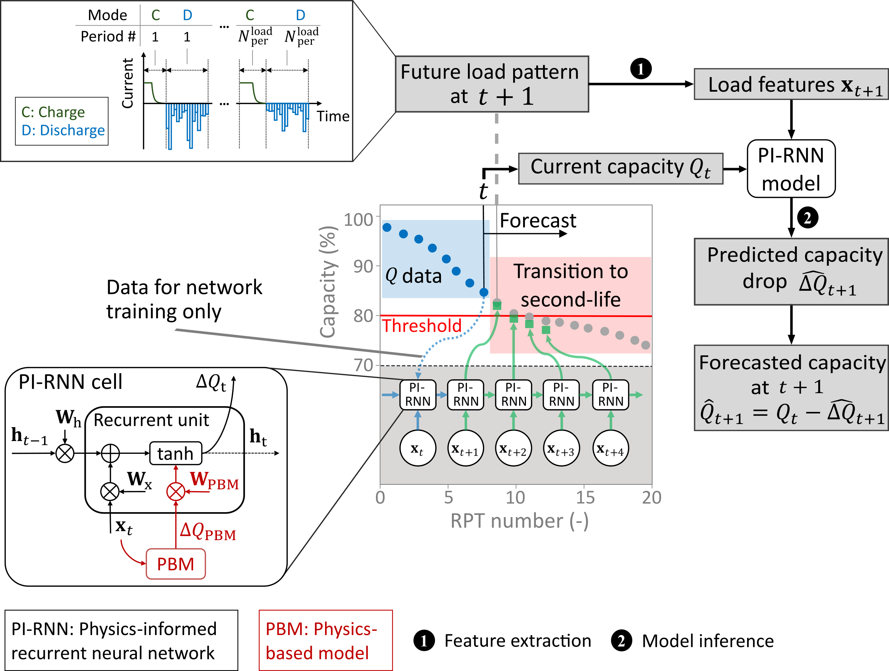

# Forecasting Battery Capacity for Second-Life Applications Using Physics-Informed Recurrent Neural Networks

This repository accompanies our published paper “Forecasting Battery Capacity for Second-Life Applications Using Physics-Informed Recurrent Neural Networks” (DOI: doi). It provides preprocessed data, models, and scripts used to train and evaluate PI‑RNN model and baseline methods for capacity forecasting.



---

## Repository Structure

- **processed_data/**  
  Merged cycling and RPT data for Batch 1 & 2 (Pickle files).

- **saved_models/**  
  Pretrained model checkpoints (PI‑RNN, Baseline RNN, etc.).

- **simulated_PBM_data/**  
  Outputs from PyBaMM experiments and extracted simulation features.

- **data_utils.py**  
  Functions to load, preprocess, and sequence raw battery and simulation data.

- **models.py**  
  Definitions of the physics-based surrogate model (PBM), PI‑RNN architecture, baseline RNNs, model-based GPR.

- **pbm_experiments.py**  
  Scripts to run PyBaMM physics-based simulations, extract features, and save simulation results.

- **preprocessing.py**  
  Pipeline to process raw cycling subfolder data, merge with RPT capacities, and plot capacity fade curves.

- **RMSE_evaluation.py**  
  Evaluation routines for single‑ and multi‑step RMSE/MAE comparisons among models.

- **training_strategies.py**  
  Training scenarios for fixed-horizon, recursive, and max-horizon forecasting, with optional fine‑tuning.

- **trajectory_forecast.py**  
  Loading of pretrained models, forecasting trajectories, and plotting with RMSE bars.

- **uncertainty_quantification.py**  
  Uncertainty quantification via Monte Carlo dropout, isotonic recalibration, and calibration curve plotting.

- **requirements.txt**  
  Python dependencies required to install.

---

## Quick Start

1. **Install dependencies**  
   ```bash
   pip install -r requirements.txt
   ```

2. **Data preprocessing**  
   Process raw cycling & RPT data and generate `processed_data/`  
   ```bash
   python preprocessing.py
   ```

3. **Run physics-based simulations**  
   Generate PBM features for a group (e.g., G1, G13):  
   ```bash
   python pbm_experiments.py
   ```

4. **Train & evaluate models**  
   - Train and evaluate PI‑RNN and baselines:  
     ```bash
     python RMSE_evaluation.py
     ```
   - Uncertainty quantification and calibration:  
     ```bash
     python uncertainty_quantification.py
     ```
   - Trajectory forecasting with pretrained models:  
     ```bash
     python trajectory_forecast.py --group G13 --cell C1
     ```

5. **Training strategies**  
   Explore different forecasting scenarios and fine‑tuning:  
   ```bash
   python training_strategies.py
   ```

---

## Citation

If you use this code, please cite:

```
@article{Paper2025,
  title={Forecasting Battery Capacity for Second-Life Applications Using Physics-Informed Recurrent Neural Networks},
  author={...},
  journal={Journal Name},
  year={2025},
  doi={placeholder doi}
}
```
